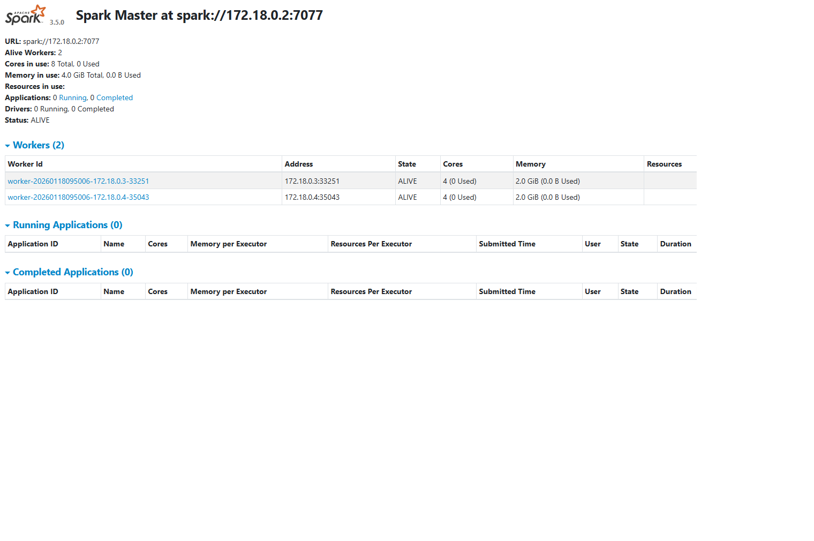
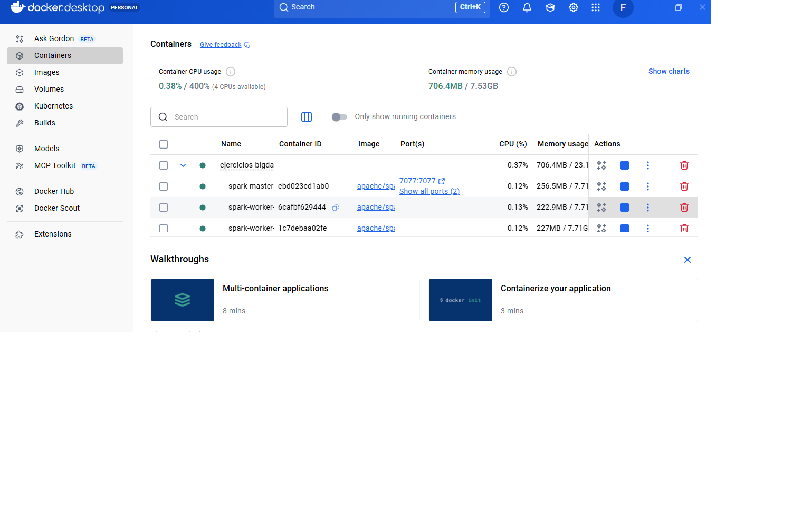

# 🐳 Virtualización con Docker: Cluster Apache Spark

## 📑 Tabla de Contenidos
- [📝 Descripción del Proyecto](#-descripción-del-proyecto)
- [🛠️ Tecnologías Utilizadas](#️-tecnologías-utilizadas)
- [🏗️ Arquitectura del Sistema](#️-arquitectura-del-sistema)
- [⚙️ Instalación y Configuración](#️-instalación-y-configuración)
- [📸 Evidencias de Funcionamiento](#-evidencias-de-funcionamiento)
- [🧪 Scripts de Prueba](#-scripts-de-prueba)
- [⚙️ Configuración Detallada](#️-configuración-detallada)
- [🔧 Resolución de Problemas](#-resolución-de-problemas)
- [🎯 Resultados y Aprendizajes](#-resultados-y-aprendizajes)
- [👤 Autor](#-autor)
- [🙏 Créditos y Referencias](#-créditos-y-referencias)

---

## 📝 Descripción del Proyecto
Implementación de un cluster Apache Spark distribuido utilizando Docker para procesamiento de Big Data. El sistema consta de 1 nodo Master y 2 Workers, conectados a almacenamiento en SSD externo mediante Junction de Windows.

## 🛠️ Tecnologías Utilizadas
- **Apache Spark 3.5.0** - Motor de procesamiento distribuido
- **Docker Desktop** - Virtualización de contenedores
- **Docker Compose** - Orquestación multi-contenedor
- **Python + PySpark** - Interface de programación
- **Windows Junction** - Enlace simbólico para optimización de almacenamiento

## 🏗️ Arquitectura del Sistema

### Componentes
- **Spark Master**: Coordinador del cluster (puerto 8080 para UI, 7077 para comunicación)
- **Spark Worker 1**: Procesador con 2GB RAM y 4 cores
- **Spark Worker 2**: Procesador con 2GB RAM y 4 cores
- **Almacenamiento**: SSD externo montado vía Junction en \F:\LABSTORAGE\data\

### Flujo de Datos
1. Los datos se almacenan físicamente en el SSD externo
2. Windows Junction crea un enlace transparente desde \./datos\ al SSD
3. Docker monta el volumen \./datos\ en cada contenedor
4. Spark lee/escribe desde \/opt/spark/data\ dentro de los contenedores

## ⚙️ Instalación y Configuración

### Requisitos Previos
- Docker Desktop instalado y ejecutándose
- SSD externo conectado (mínimo 50GB disponibles)
- Python 3.8+ con pip

### Pasos de Implementación

**1. Clonar configuración:**
\\\ash
cd ejercicios-bigdata
\\\

**2. Crear Junction al SSD** (PowerShell como Admin):
\\\powershell
cmd /c mklink /J datos "F:\LABSTORAGE\data"
\\\

**3. Arrancar cluster:**
\\\ash
docker-compose up -d
\\\

**4. Verificar estado:**
\\\ash
docker ps
\\\

**5. Acceder a Spark Master UI:**
   - Abrir navegador en \http://localhost:8080\

## 📸 Evidencias de Funcionamiento

### Cluster Operativo

*Imagen: Interfaz web de Spark Master mostrando 2 workers ALIVE con 8 cores y 4GB RAM totales*

### Contenedores Docker

*Imagen: Docker Desktop mostrando los 3 contenedores en ejecución*

## 🧪 Scripts de Prueba

### Conexión a Spark
Ver \scripts/test_spark_connection.py\ para validar conectividad con el cluster.

**Ejecutar:**
\\\ash
python scripts/test_spark_connection.py
\\\

**✅ Salida esperada:**
\\\
✅ Conexión exitosa a Spark
Versión Spark: 3.5.0
Master URL: spark://localhost:7077
\\\

## ⚙️ Configuración Detallada

### docker-compose.yml
El archivo \docker-compose.yml\ define:
- Imagen base: \pache/spark:3.5.0\
- Red interna para comunicación entre contenedores
- Volúmenes compartidos apuntando al SSD
- Limitaciones de recursos (2GB RAM por worker)

### Gestión de Recursos
- **CPU**: 4 cores por worker (8 totales)
- **Memoria**: 2GB por worker (4GB totales)
- **Disco**: Ilimitado (limitado solo por capacidad del SSD)

## 🔧 Resolución de Problemas

### Docker no arranca contenedores
\\\ash
docker-compose down
docker-compose up -d
\\\

### Junction roto (carpeta datos no accesible)
\\\powershell
# Eliminar junction corrupto
cmd /c rmdir datos

# Recrear
cmd /c mklink /J datos "F:\LABSTORAGE\data"
\\\

### Workers no se registran en Master
Verificar logs:
\\\ash
docker logs spark-worker-1
docker logs spark-worker-2
\\\

## 🎯 Resultados y Aprendizajes

### Métricas Alcanzadas
- ✅ Cluster de 3 nodos operativo
- ✅ Procesamiento distribuido funcional
- ✅ Almacenamiento optimizado en SSD
- ✅ Aislamiento mediante contenedores
- ✅ 0% de uso de disco C (todo en SSD externo)

### Habilidades Desarrolladas
- Virtualización con Docker
- Orquestación multi-contenedor con Docker Compose
- Configuración de sistemas distribuidos (Apache Spark)
- Gestión de almacenamiento en Windows (Junctions)
- Optimización de recursos en entornos limitados

## 👤 Autor
**Fernando Ramos Treviño**  
Master en Big Data - 2026  
Proyecto: Laboratorio de Virtualización y Procesamiento Distribuido

## 🙏 Créditos y Referencias
Este proyecto ha sido desarrollado siguiendo la metodología y el código base del curso de *Big Data*.
* **Autor original/Referencia:** [@TodoEconometria](https://github.com/TodoEconometria)
* **Profesor:** Juan Marcelo Gutierrez Miranda
* **Hash ID de Certificación:** 4e8d9b1a5f6e7c3d2b1a0f9e8d7c6b5a4f3e2d1c0b9a8f7e6d5c4b3a2f1e0d9c
