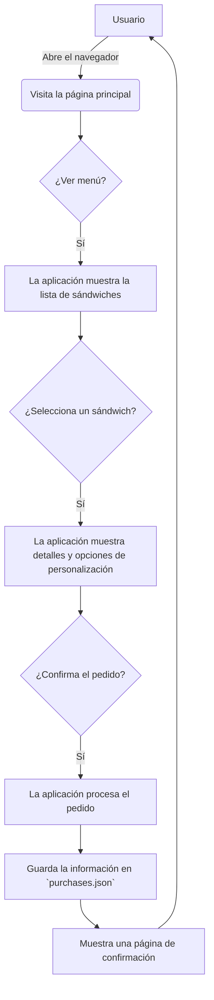

# Flask Sandwich Shop

¡Bienvenido a Flask Sandwich Shop! Una aplicación web desarrollada con Flask que permite a los usuarios pedir sándwiches personalizados.

## Descripción General

Esta aplicación presenta un menú de sándwiches, permite a los clientes personalizar sus pedidos y guarda la orden en un archivo local. Es un proyecto de demostración para ilustrar los fundamentos del desarrollo web con el framework Flask en Python.

## Estructura del Proyecto

El proyecto está organizado de la siguiente manera para separar las responsabilidades:

```
/
├── .gitignore         # Archivos y directorios ignorados por Git
├── app.py             # Lógica principal de la aplicación Flask (rutas y vistas)
├── models.py          # Clases y modelos de datos (p. ej., Sandwich, Ingrediente)
├── requirements.txt   # Lista de dependencias de Python
├── install_dependencies.py # Script para instalar dependencias
├── templates/         # Plantillas HTML (usando Jinja2)
│   └── ...
├── static/            # Archivos estáticos (CSS, JavaScript, imágenes)
│   └── ...
├── purchases.json     # Archivo para almacenar los pedidos realizados
└── README.md          # Este archivo
```

## Diagrama de Flujo (UML)

A continuación se muestra un diagrama de flujo simple que representa la interacción entre el usuario y el sistema.



## Cómo Empezar

Sigue estas instrucciones paso a paso para poner en marcha el proyecto en tu máquina local.

### Prerrequisitos

Asegúrate de tener instalado lo siguiente:
*   **Python 3.8 o superior** - [Descargar Python](https://www.python.org/downloads/)
*   **Git** - [Descargar Git](https://git-scm.com/downloads)
*   **pip** (gestor de paquetes de Python - incluido con Python)

### Instalación y Configuración

#### Paso 1: Clonar o Hacer Fork del Repositorio

**Opción A: Clonar directamente**
```bash
git clone https://github.com/TodoEconometria/sandwicheria.git
cd sandwicheria
```

**Opción B: Hacer Fork y clonar tu copia**
1. Haz clic en el botón "Fork" en la parte superior derecha de este repositorio en GitHub
2. Clona tu fork:
```bash
git clone https://github.com/TU_USUARIO/sandwicheria.git
cd sandwicheria
```

#### Paso 2: Crear y Activar un Entorno Virtual

Es importante usar un entorno virtual para mantener las dependencias del proyecto aisladas.

**En Windows:**
```bash
# Crear entorno virtual
python -m venv venv

# Activar entorno virtual
venv\Scripts\activate
```

**En macOS/Linux:**
```bash
# Crear entorno virtual
python3 -m venv venv

# Activar entorno virtual
source venv/bin/activate
```

**Nota:** Cuando el entorno virtual está activado, verás `(venv)` al inicio de tu línea de comandos.

#### Paso 3: Instalar las Dependencias

Con el entorno virtual activado, instala las dependencias necesarias:

**Método recomendado** (usando requirements.txt):
```bash
pip install -r requirements.txt
```

**Método alternativo** (usando el script):
```bash
python install_dependencies.py
```

### Ejecución de la Aplicación

Una vez que las dependencias estén instaladas y el entorno virtual esté activado, inicia el servidor de desarrollo:

**En Windows:**
```bash
flask --app app run --debug
```

**En macOS/Linux:**
```bash
flask --app app run --debug
```

El modo `--debug` reiniciará automáticamente el servidor cada vez que realices un cambio en el código.

**¡Listo!** Abre tu navegador y visita: `http://127.0.0.1:5000`

### Comandos Útiles

**Detener el servidor:**
Presiona `Ctrl + C` en la terminal donde está corriendo el servidor.

**Desactivar el entorno virtual:**
```bash
deactivate
```

**Actualizar dependencias:**
```bash
pip install --upgrade -r requirements.txt
```

## Flujo de la Aplicación

1.  **Inicio**: El servidor se inicia ejecutando `app.py`. Este archivo define las rutas (URLs) de la aplicación.
2.  **Modelos**: `models.py` contiene las clases que representan los datos de la aplicación, como `Sandwich` e `Ingredient`. Estos modelos se utilizan para gestionar la lógica de negocio.
3.  **Rutas y Vistas**: Cuando un usuario visita una URL, Flask invoca la función de vista asociada a esa ruta en `app.py`.
4.  **Renderizado de Plantillas**: La función de vista recopila los datos necesarios (por ejemplo, una lista de sándwiches) y los pasa a una plantilla HTML en el directorio `templates/`.
5.  **Interacción del Usuario**: El usuario interactúa con la página (por ejemplo, enviando un formulario para hacer un pedido).
6.  **Procesamiento de Datos**: Flask recibe los datos del formulario, los procesa y, en este caso, guarda el pedido en el archivo `purchases.json`.
7.  **Respuesta**: Finalmente, la aplicación devuelve una nueva página al usuario, como una confirmación del pedido.
